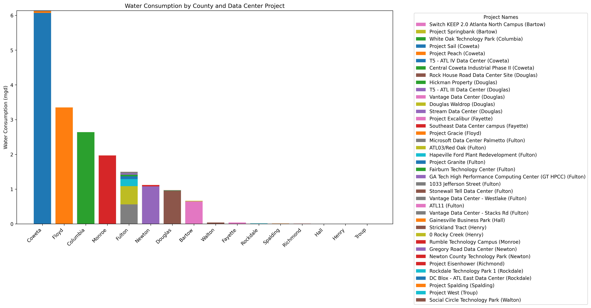

# Water usage by data centers in Georgia

* Collecting and organzing data regarding water usage by data centers in the state of Georgia by scraping data from the DRI submissions webpage
  - https://apps.dca.ga.gov/DRI/Submissions.aspx
* There are 3 csv files in the Data sub folder
  - The dri_data csv is the master csv that contains all the project info for all the projects registered in the DRi submissions webpage
  - The dri_post_processing.csv file is the csv file that contains only the raw water data for each of the projects, along with a indication of whether the project desscription contains the word 'data center'
  - The data_center.csv file contains the projects that got flagged as data centers and contains the cleaned water data for each of the projects
* There are 2 GitHub workflows under the .github sub folder
  - One workflow updates the master csv file with any new or updated submissions in the DRI submissions webpaage
  - The second workflow takes a weekly snapshot of the master csv file

