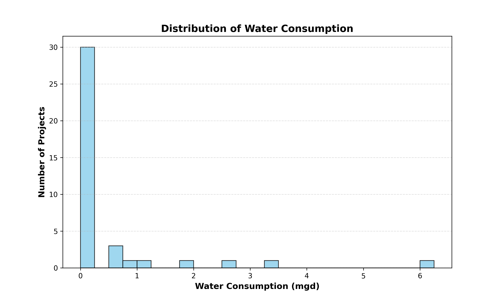

# Georgia Data Center Water Usage

This repo collects and visualizes the water consumption of publicly available data center projects via the Georgia Department of Community Affairs' [Developments of Regional Impact (DRIs) database](https://apps.dca.ga.gov/DRI/default.aspx).

Data centers primarily use water for cooling, and the amount used depends on the cooling technologies used. The plots below highlight the rapid increase in data center developments and their consumptive water loss across projects and location.

Data centers are rapidly being developed. Most of the identified data center DRIs have been proposed in the past 18 months.

Data center projects can consume millions of gallons of water a day. The below bar chart shows individual project's water consumption grouped by county.

Visualized georgraphically with color indicating per-county data center water consumption:

But not all data center projects consume millions of gallons of water per day. Smaller data centers or large projects using less water-intensive cooling technologies can have low water demand.

## Data Collection Details
* The data above is obtained by weekly scrapes of the DRI submissions webpage
  - https://apps.dca.ga.gov/DRI/Submissions.aspx
* There are 3 csv files in the Data sub folder
  - The dri_data csv is the master csv that contains all the project info for all the projects registered in the DRi submissions webpage
  - The dri_post_processing.csv file is the csv file that contains only the raw water data for each of the projects, along with a indication of whether the project desscription contains the word 'data center'
  - The data_center.csv file contains the projects that got flagged as data centers and contains the cleaned water data for each of the projects
* There are 2 GitHub workflows under the .github sub folder
  - One workflow updates the master csv file with any new or updated submissions in the DRI submissions webpaage
  - The second workflow takes a weekly snapshot of the master csv file
